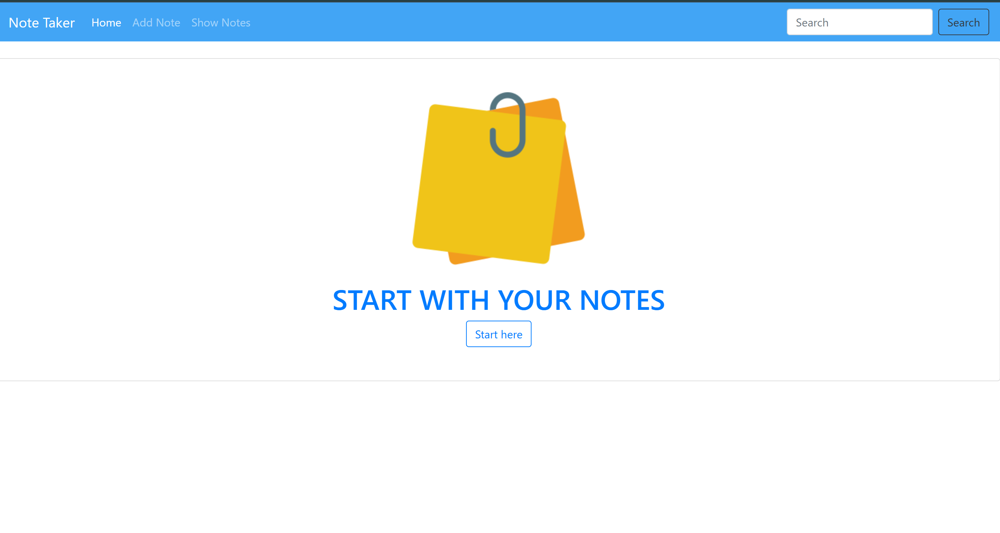
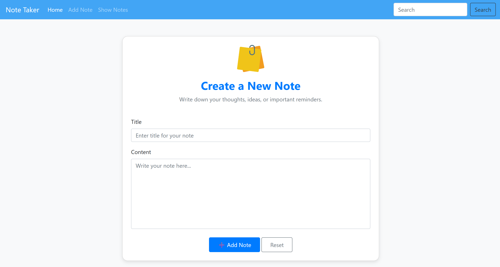
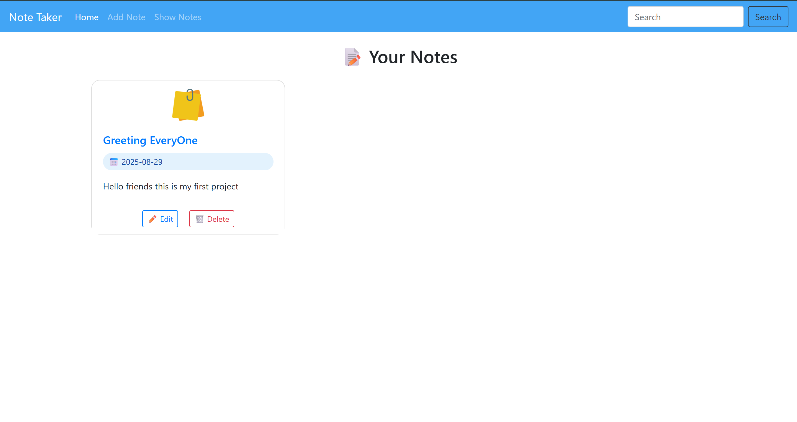
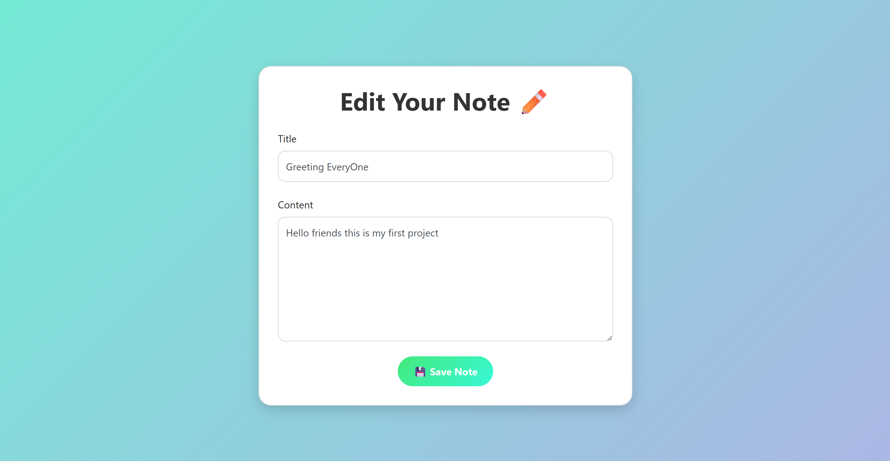

# **NoteTaker 📝**

  
  
  


A **Java Servlet + Hibernate demonstration project** that allows users to create, update, delete, and manage notes efficiently.  
This project is designed to demonstrate the integration of **Java EE (Servlets, JSP)** with **Hibernate ORM** for database persistence.  

---

## 🚀 **Features**
- ✏️ Create new notes  
- 📖 View all saved notes  
- 📝 Edit/update existing notes  
- 🗑️ Delete notes permanently  
- 💾 Database persistence using **Hibernate ORM**  
- 🎨 Simple JSP-based UI  

---

## 🛠 **Tech Stack**
- **Frontend:** JSP, HTML, CSS, Bootstrap  
- **Backend:** Java Servlets  
- **Database:** MySQL (via Hibernate ORM)  
- **Server:** Apache Tomcat  
- **IDE:** Eclipse  

---

## 📂 **Project Structure**
```

NoteTaker/
│── src/                # Java Servlet source files
│── WebContent/         # JSP pages, CSS, JS
│── WEB-INF/            # web.xml configuration
│── lib/                # Required JAR files (Hibernate, MySQL connector, etc.)
│── .gitignore
│── README.md

````

---

## 🔧 **Setup Instructions**
1. Clone the repository:  
   ```bash
   git clone https://github.com/YOUR_USERNAME/NoteTaker.git
````

2. Import the project into **Eclipse** as a Dynamic Web Project.
3. Add required JAR files (Hibernate, MySQL connector, etc.) into the **lib** folder.
4. Configure your **hibernate.cfg.xml** with database details.
5. Deploy the project on **Apache Tomcat** server.
6. Access the app in your browser:

   ```
   http://localhost:8080/NoteTaker
   ```

---

## 📸 **Screenshots**







---

## 🤝 **Contributing**

Contributions are welcome!

1. Fork the repository
2. Create a new feature branch
3. Commit changes
4. Push to your branch
5. Submit a Pull Request
